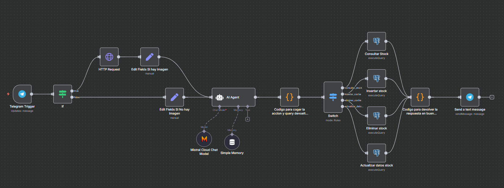
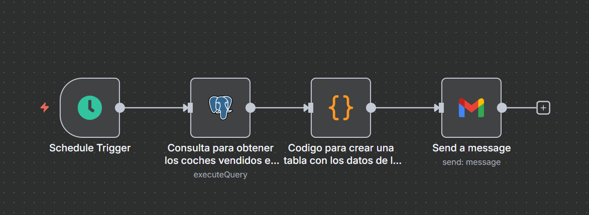
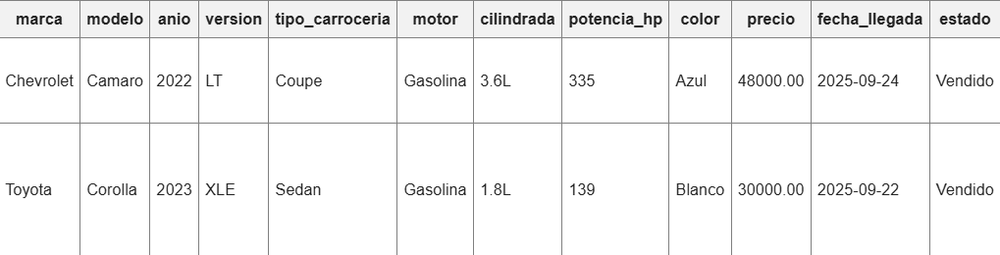

# 🚗 Automatización Inteligente de Gestión de Concesionario con n8n

Este proyecto implementa una **solución integral de automatización para la gestión de un concesionario de vehículos**, construida sobre **n8n**, **Telegram** y **modelos de inteligencia artificial**.

El sistema permite al **gestor del concesionario** administrar el inventario, registrar ventas, consultar datos y recibir reportes automáticos de rendimiento **simplemente conversando con un bot de Telegram**, sin necesidad de comandos predefinidos ni conocimientos técnicos.

---

## 🧠 Descripción General

El proyecto consta de **dos flujos principales**:

### 🔹 Workflow Principal – Automatización del Gestor (IA + Telegram + PostgreSQL)
Permite al gestor comunicarse en **lenguaje natural** con el bot de Telegram para ejecutar acciones sobre la base de datos.  
El flujo es capaz de **interpretar texto libre**, **gestionar imágenes** y **realizar consultas SQL dinámicas** gracias a un agente de IA que traduce las peticiones del usuario en operaciones estructuradas sobre PostgreSQL.

### 🔹 Workflow de Reportes Semanales – Automatización de Ventas
Cada semana, el sistema **genera y envía automáticamente un reporte HTML** con las ventas realizadas durante los últimos siete días al correo electrónico del responsable del concesionario.  
Este reporte ofrece una visión clara del rendimiento semanal y puede personalizarse fácilmente para incluir métricas adicionales.

---
## ⚙️ Workflow Principal: Gestión Inteligente vía Telegram

Este flujo constituye el núcleo de la automatización. Permite al **gestor del concesionario interactuar directamente con la base de datos** mediante lenguaje natural, enviando mensajes al bot de Telegram.  
El sistema utiliza un **agente de inteligencia artificial (AI Agent)** para interpretar las peticiones y convertirlas en consultas SQL dinámicas, haciendo posible la gestión del inventario sin necesidad de escribir comandos técnicos.

---

### 🧩 Explicación de los Componentes

| Nodo | Descripción |
|------|------------|
| Telegram Trigger | Recibe los mensajes del gestor directamente desde el bot de Telegram. |
| IF Node | Determina si el mensaje contiene una imagen (por ejemplo, al registrar un coche). |
| HTTP Request | Si hay imagen, obtiene la URL pública de la foto enviada por el usuario. |
| Edit Fields | Limpia y estructura los datos del mensaje antes de enviarlos al agente de IA. |
| AI Agent 🤖 | Interpreta el texto libre del gestor, identifica la intención (consulta, inserción, eliminación, etc.) y genera una consulta SQL coherente. |
| Function Node (Acción y Query) | Extrae la acción a realizar y prepara la query para su ejecución. |
| Switch Node | Dirige el flujo hacia el nodo PostgreSQL correspondiente según la acción detectada. |
| Nodos PostgreSQL | Ejecutan la consulta directamente sobre la base de datos del concesionario. |
| Function Node (Respuesta) | Procesa los resultados y los formatea para presentarlos en lenguaje natural. |
| Send Message Telegram 💬 | Envía la respuesta final al gestor a través del bot. |

---

### 🧠 Ejemplo de interacción con la IA

**Gestor:** “Muéstrame todos los coches disponibles entre 10.000 y 20.000 euros.”  
**Bot:** “Actualmente hay 8 vehículos en ese rango de precios.”

**Gestor:** “Añade un coche marca Audi, modelo A3, año 2021, color gris, precio 15.000, matrícula 4521LJK.”  
**Bot:** “✅ 🚗 Coche insertado exitosamente: Audi A3 (2021) – Precio: 15.000€”

**Gestor:** “Marca como vendido el coche con matrícula 4521LJK.”  
**Bot:** “💰 🚗 Coche vendido: Audi A3 (2021).”

---

### 🧾 Características destacadas

- **Interacción 100% en lenguaje natural** – sin comandos o sintaxis específica.  
- **Soporte para imágenes** – el bot puede procesar fotos al registrar vehículos.  
- **Consultas SQL dinámicas** generadas automáticamente por el agente IA.  
- **Flujo modular y escalable** – cada acción (insertar, eliminar, consultar, etc.) tiene su propio nodo PostgreSQL.  
- **Respuestas naturales y formateadas** – el gestor recibe mensajes claros directamente en Telegram.  

---

### 📊 Workflow Secundario: Reportes Semanales Automáticos

Este flujo se ejecuta automáticamente todos los lunes a las 8:00 a.m. y genera un reporte HTML con las ventas de los últimos 7 días, que se envía por correo al responsable del concesionario.

---

### 📨 Resultado

Cada semana, el gestor recibe un correo con una tabla que muestra:

---

### 🧰 Tecnologías utilizadas

| Tecnología                  | Uso                                               |
|------------------------------|-------------------------------------------------|
| n8n                          | Motor principal de automatización               |
| Telegram Bot API             | Canal de interacción con el gestor             |
| PostgreSQL                   | Base de datos de coches y ventas               |
| AI Agent (OpenAI / Mistral) | Interpretación del lenguaje natural            |
| HTTP Request + File Handling | Gestión de imágenes enviadas por Telegram      |
| Gmail API                    | Envío automático de reportes semanales         |

---

## 🚀 Cómo usar el proyecto

1. Configura tu instancia de n8n (local o en servidor).
2. Importa los workflows:
   - `Workflow Automatización Concesionario.json`
   - `Workflow Concesionario Reportes Semanales de Ventas.json`
3. Crea las credenciales necesarias:
   - Telegram Bot API Token
   - PostgreSQL
   - AI Agent (OpenAI o Mistral)
   - Gmail OAuth2
4. Activa ambos workflows desde el panel de n8n.
5. Comienza a interactuar con tu bot de Telegram. 🚀

---

### 🛡️ Seguridad

Este repositorio no incluye credenciales reales.  
Antes de ejecutar los flujos, debes configurar los valores marcados como:

- `<TELEGRAM_BOT_TOKEN>`  
- `<TO_BE_CONFIGURED>`  
- `<EMAIL_DESTINO>`

---

## 👨‍💼 Autor

Proyecto desarrollado por **Carlos Pacheco Frutos**  

🔗 Automatización avanzada con **n8n + IA + PostgreSQL + Telegram**
